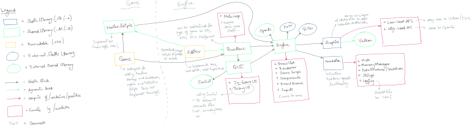

# Planning
This repository contains documentation for the planning phase of the engine

### Modules
The main modules in the project include -

1. Engine
2. Foundation
3. Graphics
4. GUI
5. Runtime
6. Editor --> This will be replaced by a slew of standalone tools (material editor, visual scripting, data converters, etc.) Check [Tools](Tools.md)
7. Game
8. Scripts

| Module | Type | Function |
| ------ | ---- | --------- |
| Foundation | [Object lib](https://cmake.org/cmake/help/latest/command/add_library.html#object-libraries) | Provides platform-agnostic essential functionality - memory management, string handling, data structures, math, etc. |
| Graphics | Object lib | Provides API abstraction over Vulkan (and other graphics API in the future). |
| Engine | Shared lib | Provides APIs and implementation of base Engine functionality - rendering, asset management, inputs, scene graph, components, events, etc. |
| GUI | Shared lib | Provides API for creating in-game GUI components using Engine's renderer and debugging UI (using ImGui). |
| Runtime | Shared lib | Implements the Main loop (or Game loop) with callback setup and Engine start up and shutdown sequences. Runs lua scripts and registered native scripts. (Intended to be customized for various application types - Shooter games, RPG, 3D Model Viewer app, etc.) |
| Editor | Executable | Provides GUI and console based tools for faster and user-friendly game development iteration - Level editor, Material editor, Shader graph, Asset importer, etc. |
| Game | Executable | Wrapper over the Runtime library for boilerplate code to initialize and register scripts. |
| NativeScripts | Shared lib | Game logic written by game designers and developers in native C++ API. (Focused toward critical section/high performance game code.) |
| LuaScripts | Lua lib | Game entity specialization/loading scripts and game logic in Lua. (Focused toward faster iteration. Not for high performance game code.) |

